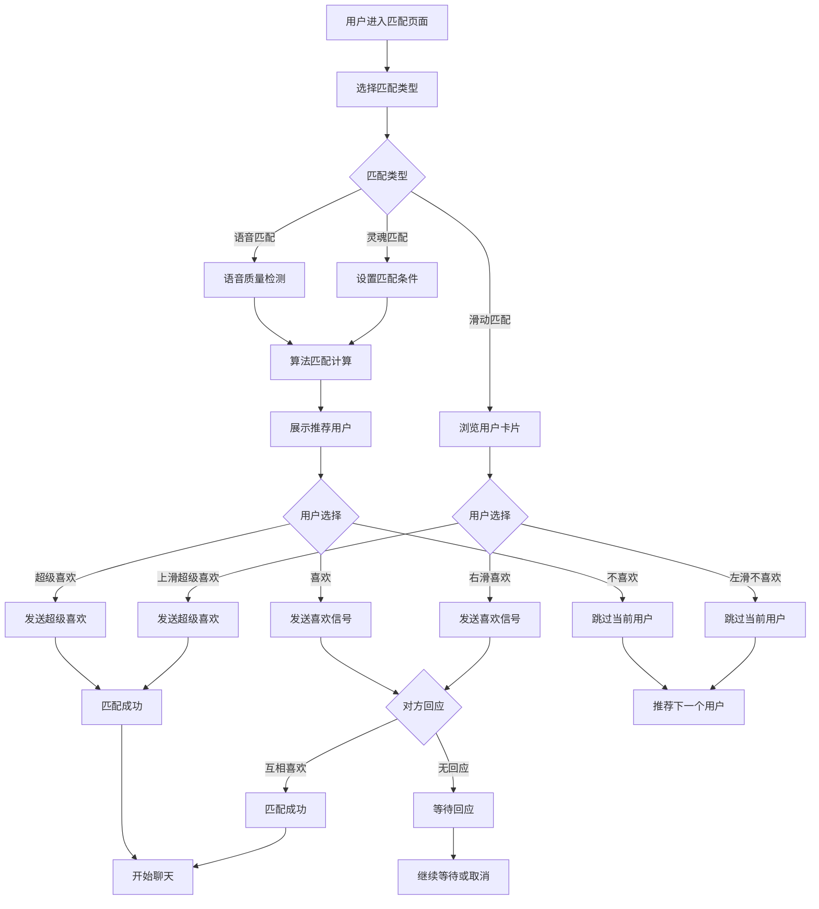

# MetaLinkr PWA 业务流程图

## 📋 文档概述

本文档详细描述了 MetaLinkr PWA 应用的完整业务流程，包括用户注册、Soul风格社交、匹配系统、聊天互动等核心业务场景的流程图和说明。

## 🎯 核心业务流程

### 1. 👤 用户注册与认证流程

#### 流程说明
- **登录方式**: 支持手机号密码、第三方登录（微信、QQ、微博）、测试登录
- **注册流程**: 手机号注册、验证码验证、密码设置、信息填写
- **验证机制**: 手机号验证码验证，确保用户真实性
- **快速体验**: 提供测试登录功能，便于快速体验

### 2. 🌍 星球互动流程

#### 流程说明
- **星球概念**: Soul风格的星球页面，展示用户状态和功能
- **功能入口**: 灵魂测试、星座匹配、灵魂匹配、语音匹配
- **功能卡片**: 同城卡、加速卡、定位卡等增值服务
- **匹配系统**: 多种匹配方式，智能推荐用户
- **实时通信**: 匹配成功后进入聊天界面

### 3. 🎯 智能匹配流程

#### 流程说明
- **匹配类型**: 支持灵魂匹配、语音匹配、滑动匹配等多种方式
- **智能算法**: 基于兴趣、地理位置、活跃度等多维度匹配
- **用户选择**: 支持喜欢、不喜欢、超级喜欢等操作
- **匹配成功**: 双方互相喜欢后建立匹配关系
- **滑动操作**: 类似Tinder的滑动界面，提升用户体验
- **匹配设置**: 年龄范围、性别偏好、距离设置等个性化配置

### 4. 💬 聊天互动流程

#### 流程说明
- **聊天列表**: 显示所有聊天会话和未读消息
- **实时聊天**: 支持文字、表情、语音、图片等多种消息类型
- **消息推送**: 基于 WebSocket 的实时消息推送
- **聊天记录**: 完整的聊天历史记录保存
- **积分奖励**: 聊天互动获得相应积分奖励

### 5. 📺 直播互动流程

#### 流程说明
- **直播观看**: 支持高清直播观看和互动
- **弹幕互动**: 实时弹幕消息发送和显示
- **礼物打赏**: 多种礼物选择，支持动画效果
- **连麦功能**: 观众可申请与主播连麦互动
- **关注系统**: 关注主播获得积分奖励

### 6. 🎮 游戏社交流程

#### 流程说明
- **游戏绑定**: 支持多款热门游戏账号绑定
- **数据同步**: 自动同步游戏段位、战绩等数据
- **开黑房间**: 创建或加入游戏房间，支持语音开黑
- **好友系统**: 添加游戏好友，建立游戏社交关系
- **积分奖励**: 游戏相关操作获得积分奖励

### 7. 📺 直播互动流程

#### 流程说明
- **直播观看**: 支持高清直播观看和互动
- **弹幕互动**: 实时弹幕消息发送和显示
- **礼物打赏**: 多种礼物选择，支持动画效果
- **连麦功能**: 观众可申请与主播连麦互动
- **关注系统**: 关注主播获得积分奖励

### 8. 🎁 礼物系统流程

#### 流程说明
- **礼物商店**: 提供多种礼物选择，价格不同
- **积分消费**: 发送礼物消耗相应积分
- **动画效果**: 礼物发送时有特殊动画效果
- **通知系统**: 接收方实时收到礼物通知
- **等级系统**: 发送礼物可提升用户等级

### 9. 🏆 积分系统流程

#### 流程说明
- **积分获取**: 通过多种用户行为获得积分奖励
- **等级系统**: 积分累计达到一定数量可提升等级
- **特权解锁**: 高等级用户可解锁更多特权功能
- **积分消费**: 积分可用于购买皮肤、解锁特权、发送礼物等
- **激励机制**: 通过积分系统激励用户持续使用应用

### 10. 🔄 用户生命周期流程

#### 流程说明
- **新用户引导**: 完善的注册和首次使用引导流程
- **用户留存**: 通过积分系统和社交功能提高用户留存率
- **用户增长**: 通过推荐机制实现用户自然增长
- **流失分析**: 分析用户流失原因，持续优化产品功能
- **价值提升**: 活跃用户为平台创造更多价值

## 📊 业务流程数据统计

### 关键指标
- **用户注册转化率**: 目标 > 80%
- **日活跃用户数**: 目标 > 10万
- **用户留存率**: 7日留存 > 60%，30日留存 > 40%
- **社交互动率**: 目标 > 70%
- **匹配成功率**: 目标 > 30%
- **购物转化率**: 目标 > 15%
- **积分使用率**: 目标 > 50%

### 业务流程优化建议
1. **简化注册流程**: 减少注册步骤，提高转化率
2. **增强社交互动**: 提供更多互动方式，提高用户粘性
3. **优化匹配算法**: 提高匹配准确率和成功率
4. **完善支付体验**: 简化支付流程，提高购物转化率
5. **丰富积分玩法**: 增加积分获取和使用场景
6. **加强用户引导**: 提供更好的新用户引导体验

## 🔧 技术实现要点

### 实时通信
- 使用 WebSocket 实现实时消息推送
- 支持语音、视频通话功能
- 实现直播弹幕和礼物动画

### 地理位置服务
- 集成高德地图或百度地图 API
- 实现位置定位和附近地点推荐
- 支持地点打卡和轨迹记录

### 支付集成
- 集成微信支付、支付宝等支付方式
- 实现订单管理和物流跟踪
- 支持积分抵扣和优惠券使用

### 数据存储
- 使用 MySQL 存储用户和业务数据
- 使用 Redis 缓存热点数据
- 使用 MinIO 存储图片和视频文件

### 安全防护
- 实现用户数据加密存储
- 添加 API 接口鉴权机制
- 实现支付安全保护

## 📈 业务监控与优化

### 监控指标
- 用户行为数据监控
- 业务流程转化率监控
- 系统性能监控
- 错误日志监控

### 优化策略
- 基于数据分析优化业务流程
- 持续改进用户体验
- 提升系统性能和稳定性
- 加强安全防护措施

---

*本文档将持续更新，以反映产品功能的变化和业务流程的优化。*
