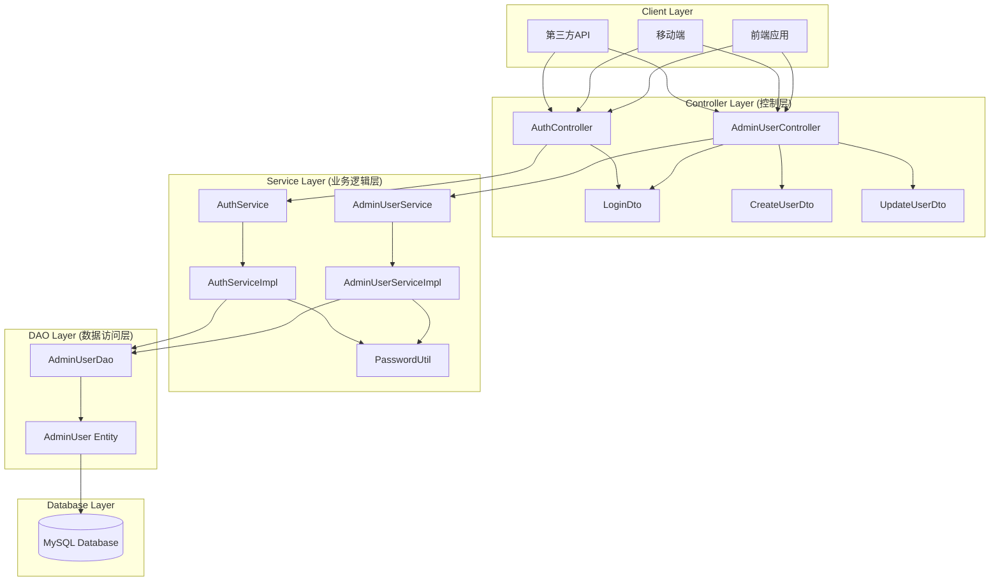
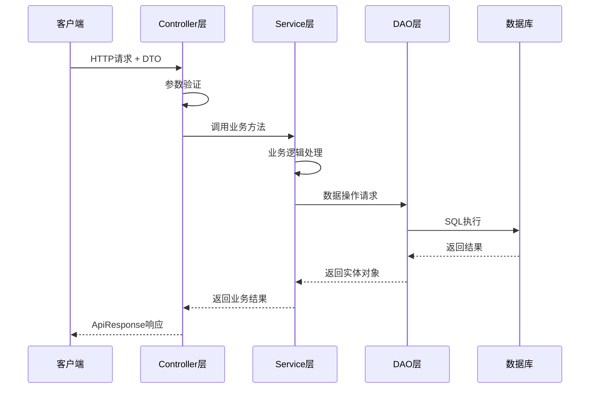

# LinkrMix Admin Module 三层架构设计

## 🏗️ 项目结构

```
admin-module/
├── src/main/java/com/aleks/linkrmix/admin/
│   ├── AdminModuleApplication.java          # 主启动类
│   ├── controller/                          # 控制层 (Web层)
│   │   ├── AdminUserController.java         # 用户管理控制器
│   │   ├── AuthController.java              # 认证控制器
│   │   └── dto/                             # 数据传输对象
│   │       ├── LoginDto.java                # 登录请求DTO
│   │       ├── CreateUserDto.java           # 创建用户DTO
│   │       └── UpdateUserDto.java           # 更新用户DTO
│   ├── service/                             # 业务逻辑层
│   │   ├── AdminUserService.java            # 用户服务接口
│   │   ├── AuthService.java                 # 认证服务接口
│   │   └── impl/                            # 服务实现类
│   │       ├── AdminUserServiceImpl.java    # 用户服务实现
│   │       └── AuthServiceImpl.java         # 认证服务实现
│   ├── dao/                                 # 数据访问层
│   │   └── AdminUserDao.java                # 用户数据访问对象
│   ├── entity/                              # 实体类
│   │   └── AdminUser.java                   # 管理员用户实体
│   ├── common/                              # 通用组件
│   │   └── ApiResponse.java                 # 统一API响应格式
│   ├── util/                                # 工具类
│   │   └── PasswordUtil.java                # 密码工具类
│   └── config/                              # 配置类
│       └── SecurityConfig.java              # 安全配置
└── src/main/resources/
    └── application.yml                      # 应用配置文件
```

## 📊 三层架构图示



## 🔄 数据流向图



## 🎯 各层职责

### 1. Controller层 (控制层)
- **职责**: 处理HTTP请求，参数验证，返回响应
- **组件**: 
  - `AdminUserController`: 用户管理相关API
  - `AuthController`: 认证相关API
  - `DTO类`: 数据传输对象，用于请求参数封装

### 2. Service层 (业务逻辑层)
- **职责**: 业务逻辑处理，事务管理，数据转换
- **组件**:
  - `AdminUserService`: 用户管理业务接口
  - `AuthService`: 认证业务接口
  - `ServiceImpl类`: 具体业务实现
  - `PasswordUtil`: 密码加密工具

### 3. DAO层 (数据访问层)
- **职责**: 数据库操作，数据持久化
- **组件**:
  - `AdminUserDao`: 用户数据访问对象
  - `AdminUser`: 用户实体类

## 📋 API接口设计

### 用户管理接口
- `GET /api/admin/users` - 获取用户列表
- `GET /api/admin/users/{id}` - 获取指定用户
- `POST /api/admin/users` - 创建用户
- `PUT /api/admin/users/{id}` - 更新用户
- `DELETE /api/admin/users/{id}` - 删除用户

### 认证接口
- `POST /api/auth/login` - 用户登录

## 🔧 技术栈

- **框架**: Spring Boot 2.7.18
- **安全**: Spring Security 5.8.11
- **数据库**: MySQL 8.0.33
- **数据访问**: Spring JDBC
- **构建工具**: Maven
- **Java版本**: 1.8

## 🚀 部署架构

```
┌─────────────────┐
│   admin-module  │
│   (8080)        │
└─────────────────┘
         │
         ▼
┌─────────────────┐
│     MySQL       │
│   (3306)        │
└─────────────────┘
```

## 🎯 架构优势

1. **清晰的分层**: 每层职责明确，便于维护和测试
2. **松耦合**: 层与层之间通过接口交互，降低耦合度
3. **可扩展性**: 便于添加新的功能模块
4. **可测试性**: 每层都可以独立进行单元测试
5. **标准化**: 遵循Spring Boot最佳实践
6. **统一响应**: 使用ApiResponse统一API响应格式
