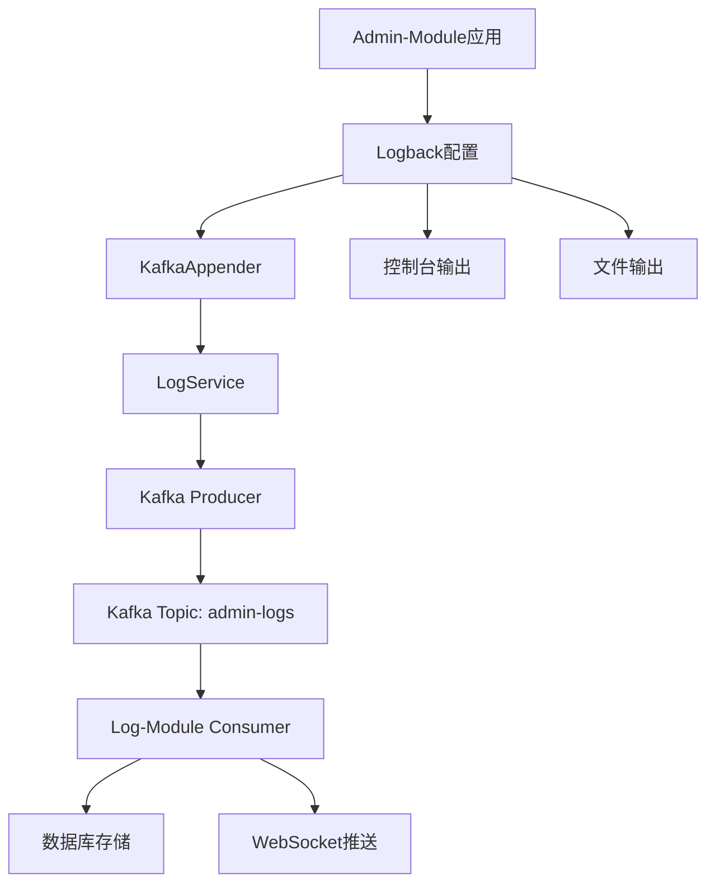

# Admin-Module Kafka日志收集功能

## 概述

admin-module现在通过Kafka消息队列将日志发送到log-module进行统一收集和管理，不再需要直接写入数据库。

## 架构设计



## 功能特性

### 1. 自动日志收集
- 所有admin-module的日志都会自动发送到Kafka
- 支持INFO、DEBUG、WARN、ERROR等各级别日志
- 自动记录日志的详细信息（时间戳、级别、模块、消息、堆栈等）

### 2. 日志输出位置
- **控制台**: 实时查看日志
- **文件**: `logs/admin-module.log` 和 `logs/admin-module-error.log`
- **Kafka**: 自动发送到 `admin-logs` 主题

### 3. 服务配置
- 服务名称: `admin-module`
- Kafka主题: `admin-logs`
- 日志路径: `logs/admin-module.log`
- 状态: `running`

## 配置说明

### 1. Logback配置 (`logback-spring.xml`)
```xml
<!-- Kafka日志Appender -->
<appender name="KAFKA" class="com.aleks.linkrmix.admin.common.config.DatabaseAppender"/>

<!-- 应用日志级别 -->
<logger name="com.aleks.linkrmix.admin" level="DEBUG" additivity="false">
    <appender-ref ref="CONSOLE"/>
    <appender-ref ref="FILE"/>
    <appender-ref ref="ERROR_FILE"/>
    <appender-ref ref="KAFKA"/>
</logger>
```

### 2. Kafka配置 (`application.yml`)
```yaml
spring:
  kafka:
    bootstrap-servers: localhost:9092
    producer:
      key-serializer: org.apache.kafka.common.serialization.StringSerializer
      value-serializer: org.springframework.kafka.support.serializer.JsonSerializer
      acks: all
      retries: 3

kafka:
  topic:
    log: admin-logs
```

### 3. 自定义KafkaAppender
- 自动将日志转换为LogVO格式
- 提取模块信息（controller、service、mapper等）
- 记录异常堆栈信息
- 通过LogService发送到Kafka

## 测试方法

### 1. 启动服务
启动admin-module服务后，会自动生成启动日志：
```bash
# 启动服务
cd linkr-server/admin-module
mvn spring-boot:run
```

### 2. 使用测试接口生成日志

#### 生成INFO日志
```bash
curl -X POST http://localhost:8080/api/test-logs/info \
  -H "Content-Type: application/json" \
  -d '{"message": "测试INFO日志"}'
```

#### 生成ERROR日志
```bash
curl -X POST http://localhost:8080/api/test-logs/error \
  -H "Content-Type: application/json" \
  -d '{"message": "测试ERROR日志"}'
```

#### 生成带异常的ERROR日志
```bash
curl -X POST http://localhost:8080/api/test-logs/error-with-exception \
  -H "Content-Type: application/json" \
  -d '{"message": "测试异常日志"}'
```

#### 批量生成日志
```bash
curl -X POST http://localhost:8080/api/test-logs/multiple \
  -H "Content-Type: application/json" \
  -d '{"count": 10}'
```

#### 生成业务日志
```bash
curl -X POST http://localhost:8080/api/test-logs/business \
  -H "Content-Type: application/json" \
  -d '{"operation": "查询用户列表", "userId": "admin"}'
```

### 3. 查看日志

#### 查看文件日志
```bash
# 查看普通日志
tail -f logs/admin-module.log

# 查看错误日志
tail -f logs/admin-module-error.log
```

#### 查看Kafka消息
```bash
# 使用kafka-console-consumer查看消息
kafka-console-consumer --bootstrap-server localhost:9092 --topic admin-logs --from-beginning
```

## 在日志平台中查看

1. 启动admin-module服务
2. 启动log-module服务
3. 访问日志查询页面
4. 在服务筛选中选择 `admin-module`
5. 可以看到所有admin-module的日志记录

## 日志字段说明

| 字段 | 说明 | 示例 |
|------|------|------|
| id | 日志ID | UUID格式 |
| createTime | 创建时间 | 2024-01-15 10:30:00 |
| level | 日志级别 | INFO, DEBUG, WARN, ERROR |
| serviceName | 服务名称 | admin-module |
| module | 模块名称 | controller, service, mapper等 |
| operation | 操作描述 | 具体的日志内容 |
| method | 方法信息 | 类名.方法名:行号 |
| errorMsg | 错误信息 | 异常时的堆栈信息 |
| params | 参数信息 | 线程名称等 |

## 模块分类

- **controller**: 控制器层日志
- **service**: 服务层日志
- **mapper**: 数据访问层日志
- **config**: 配置类日志
- **spring**: Spring框架日志
- **mybatis**: MyBatis日志
- **application**: 应用层日志

## 注意事项

1. 确保Kafka服务正常运行
2. 确保log-module服务正常运行并消费消息
3. 日志发送是异步的，可能有轻微延迟
4. 避免在KafkaAppender中产生循环调用
5. 生产环境建议调整日志级别为INFO或WARN

## 故障排查

### 1. 日志没有发送到Kafka
- 检查Kafka服务状态
- 检查Kafka配置是否正确
- 查看控制台错误信息

### 2. 日志格式不正确
- 检查LogVO字段映射
- 确认时间戳格式

### 3. 性能问题
- 考虑使用异步发送
- 调整日志级别
- 优化Kafka配置

## 与log-module的集成

admin-module的日志通过以下流程被log-module收集：

1. **日志生成**: admin-module应用产生日志
2. **Kafka发送**: KafkaAppender将日志发送到Kafka
3. **消息消费**: log-module的LogConsumerService消费消息
4. **数据库存储**: 日志被存储到log_entry表
5. **实时推送**: 通过WebSocket推送到前端

这样就实现了统一的日志收集和查询功能，admin-module不需要直接操作数据库，所有日志都通过Kafka进行传输。
